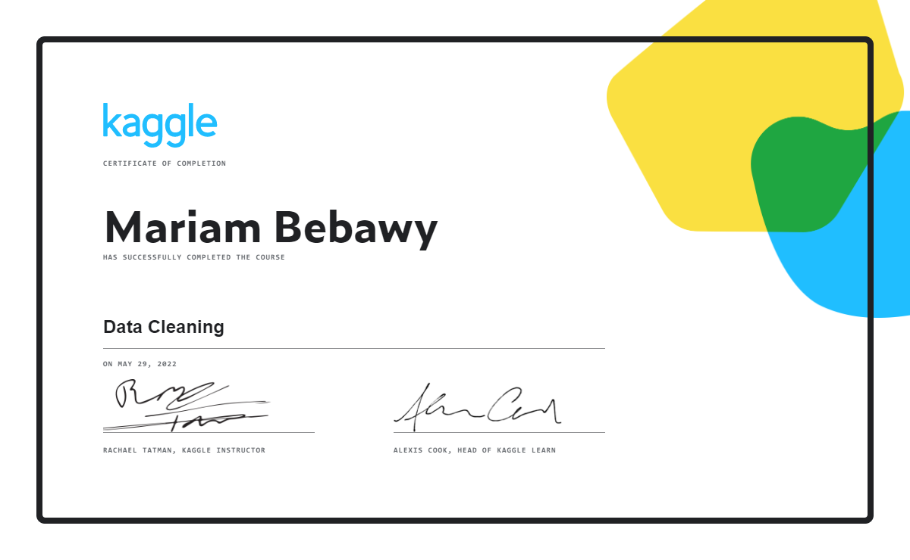

# KAGGLE_DataCleaning
Kaggle learning resources and tasks  
-- Data Cleaning  
-- As required by Technocolabs Machine Leanring Internship Program

***
### Notebooks exercises:
1. [Handling Missing Values](./01-01_handling-missing-values.ipynb)
2. [Scaling and Normalization](./01-02_scaling-and-normalization.ipynb)
3. [Parsing Dates](./01-03_parsing-dates.ipynb)
4. [Character Encodings](./01-04_character-encodings.ipynb)
5. [Inconsistent Data Entry](./01-05_inconsistent-data-entry.ipynb)

***
### Certificate:

***
### Helpful links:
* https://technocolabs-internship.gitbook.io/internship-prerequisites-learning-resources/
* https://www.kaggle.com/learn/data-cleaning/
* https://github.com/Shamik-07/Data-Cleaning-Scaling-Parsing-Dates-challenge-Kaggle/blob/master/Data%20Cleaning%2C%20Scaling%2C%20Parsing%20Dates%2C%20challenge%20Kaggle.ipynb/