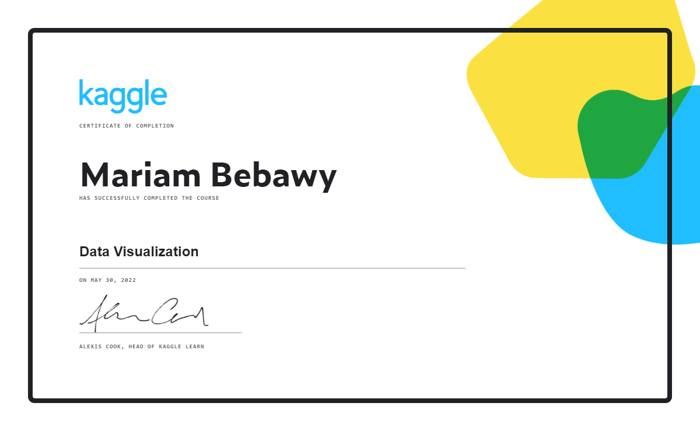

# KAGGLE_DataVisualization
Kaggle learning resources and tasks  
-- Data Visualization  
-- As required by Technocolabs Machine Leanring Internship Program

***
### Notebooks exercises:
1. [Hello, Seaborn](./02-01_hello-seaborn.ipynb)
2. [Line Charts](./02-02_line-charts.ipynb)
3. [Bar Charts and Heatmaps](./02-03_bar-charts-and-heatmaps.ipynb)
4. [Scatter Plots](./02-04_scatter-plots.ipynb)
5. [Distributions](./02-05_distributions.ipynb)
6. [Choosing Plot Types and Custom Styles](./02-06_choosing-plot-types-and-custom-styles.ipynb)
7. [Final Project](./02-07_final-project.ipynb)

***
### Certificate:

***
### Helpful links:
* https://technocolabs-internship.gitbook.io/internship-prerequisites-learning-resources/
* https://www.kaggle.com/code/alexisbcook/choosing-plot-types-and-custom-styles/
* https://www.kaggle.com/learn/data-visualization/