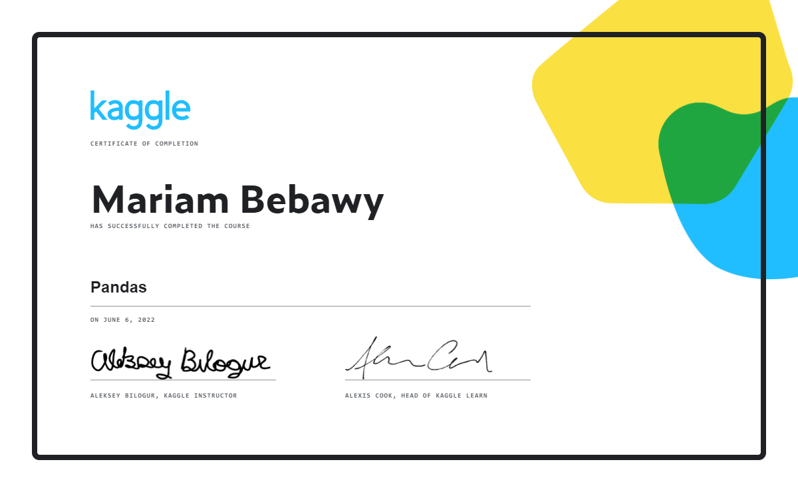

# KAGGLE_DataManipulation
Kaggle learning resources and tasks  
-- Data Manipulation  
-- As required by Technocolabs Machine Leanring Internship Program

***
### Notebooks exercises:
1. [Creating, Reading and Writing](./03-01_creating-reading-and-writing.ipynb)
2. [Indexing, Selecting & Assigning](./03-02_indexing-selecting-assigning.ipynb)
3. [Summary Functions and Maps](./03-03_summary-functions-and-maps.ipynb)
4. [Grouping and Sorting](./03-04_grouping-and-sorting.ipynb)
5. [Data Types and Missing Values](./03-05_data-types-and-missing-values.ipynb)
6. [Renaming and Combining](./03-06_renaming-and-combining.ipynb)

***
### Certificate:

***
### Helpful links:
* https://technocolabs-internship.gitbook.io/internship-prerequisites-learning-resources/
* https://www.kaggle.com/code/residentmario/summary-functions-and-maps/
* https://www.kaggle.com/learn/pandas/